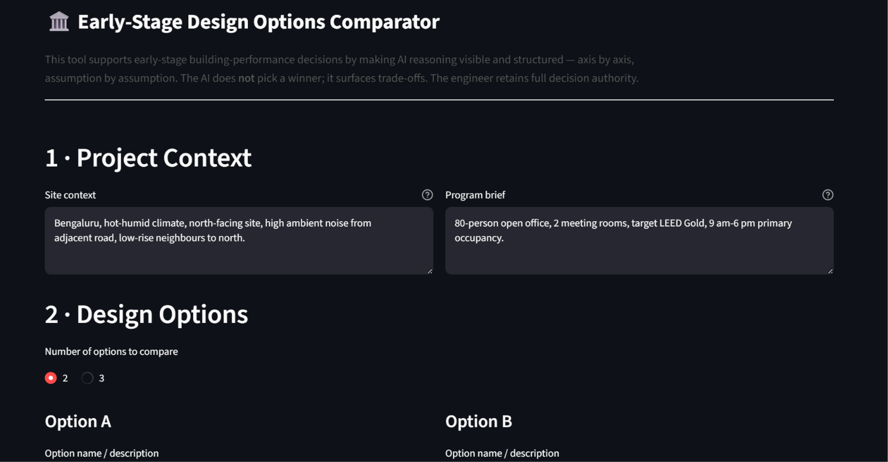
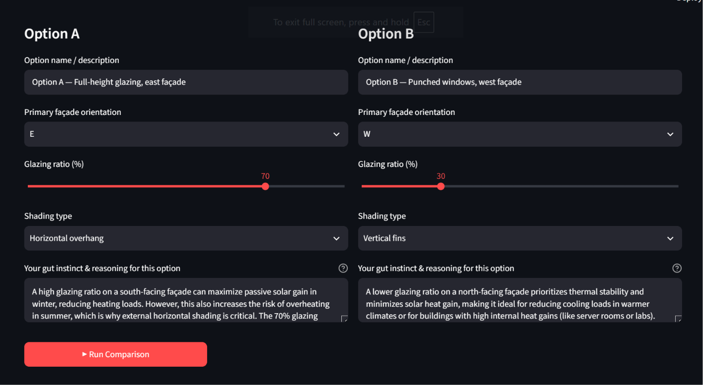
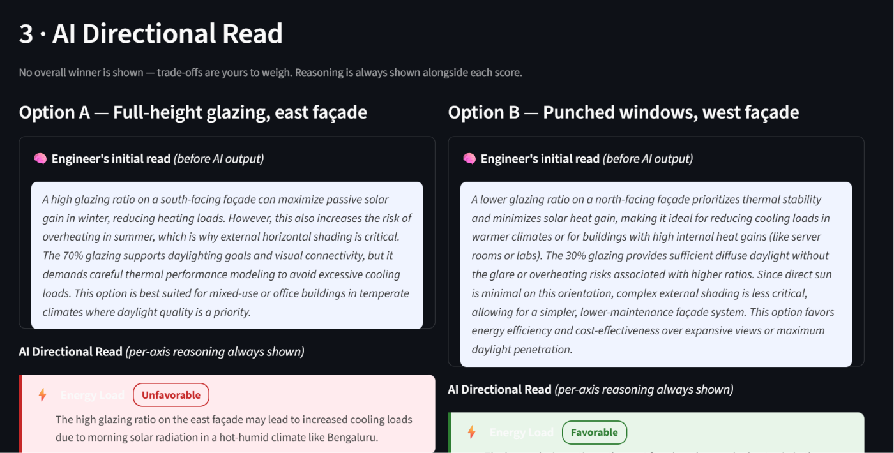
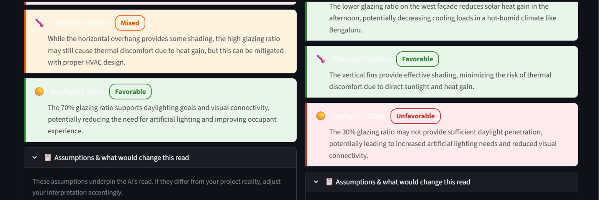
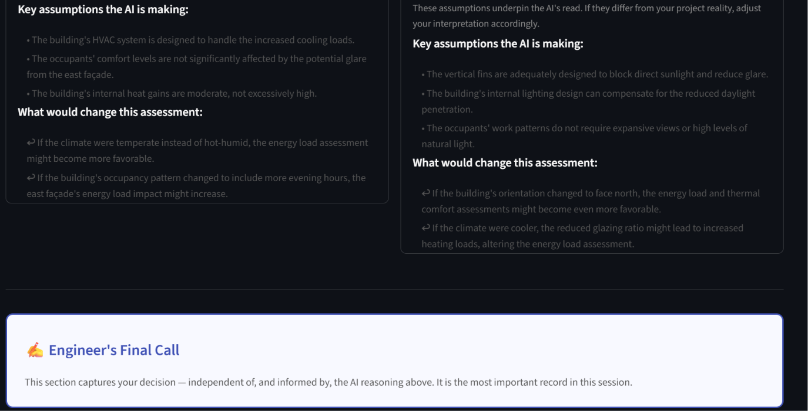
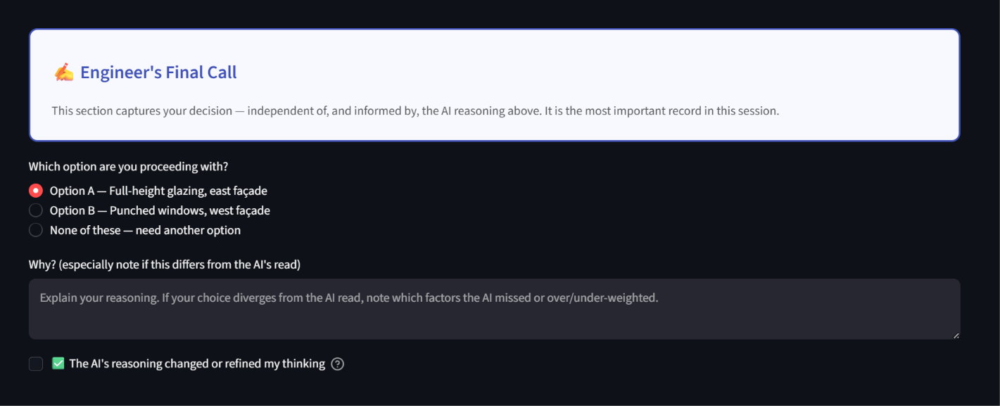
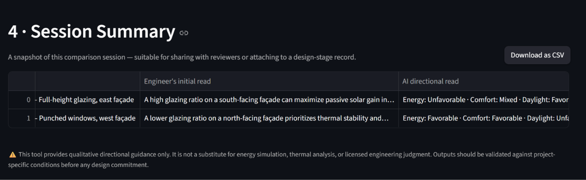

# Early-Stage Design Options Comparator
### A Transparent AI Reasoning Tool for Building-Performance Engineers

> *Built as a working prototype for a first-round assignment — "AI Practice Consultant" role at an architecture/engineering firm.*

---

## What Is This Project?

This is a **working web application** that demonstrates a specific, principled approach to human–AI collaboration in early-stage architectural design decisions.

The scenario: a **building-performance engineer** is evaluating 2–3 façade design options at the earliest stage of a project — before any energy simulation, thermal modelling, or detailed technical analysis has begun. These early decisions (orientation, glazing ratio, shading strategy) have an outsized impact on downstream performance, yet they are made with the least information and the most uncertainty.

The engineer needs help. But they are also **skeptical of black-box AI** — understandably so. A tool that says "Option B is best" and stops there is not trustworthy. It gives no basis for agreement or disagreement. It cannot be cross-examined. And if it is wrong, the engineer has no way of knowing.

This tool exists to solve that problem.

---

## The Core Design Principle

> **AI reasoning must always be visible. The human retains final authority — structurally, not just in principle.**

Every design decision in this tool flows from two commitments:

### 1. Reasoning adjacent to every output
No score, directional read, or assessment appears without the sentence that justifies it. This is not cosmetic. It is the mechanism that allows an expert to catch a wrong assumption before it propagates into a decision. A score without reasoning is a black box. A score *with* reasoning is a starting point for conversation.

### 2. No overall winner — ever
The AI is explicitly instructed, in the system prompt, *not* to produce a ranking, recommendation, or single "best option." It produces per-axis directional reads: Energy Load, Thermal Comfort, and Daylight/Glare — each assessed independently, each with a one-sentence rationale. The engineer sees three separate trade-off pictures and decides how to weigh them. This is intentional and enforced — not a missing feature.

---

## The Problem This Addresses

Early-stage design decisions are typically made through:
- Engineer experience and heuristics
- Rule-of-thumb benchmarks
- Informal team discussion

These are valuable. But they are also opaque, hard to document, and difficult to audit later. When a building underperforms, tracing the decision back to an early assumption is often impossible.

AI can help surface and structure those assumptions — but only if it is designed to show its work. The risk of AI in design is not that it gives bad answers. It is that it gives confident-sounding answers that *look* authoritative enough to bypass professional judgment.

This tool is designed to resist that failure mode.

---

## How the Tool Works

### Step 1 — Engineer Inputs (Before Seeing AI Output)

The engineer provides:

| Input | Purpose |
|---|---|
| **Site context** | Climate, orientation, surroundings, constraints (free text) |
| **Program brief** | Occupancy, use, certification target (free text) |
| **Design options (2–3)** | Each with: orientation, glazing ratio (10–90%), shading type |
| **Gut instinct per option** | The engineer's *own* read, captured **before** seeing the AI output |

The gut instinct field is deliberate. It creates a record of the engineer's independent judgment at the moment of decision, before any AI influence. This becomes the comparison baseline in the session summary.

---

### Step 2 — AI Reasoning Layer (Groq / LLaMA 3.3 70B)

When "Run Comparison" is clicked, the tool sends the full context to the Groq API (model: `llama-3.3-70b-versatile`, temperature: 0.35).

The system prompt enforces strict rules:
- Score **exactly three axes** per option: Energy Load, Thermal Comfort, Daylight/Glare
- Each score is one of: **Favorable / Mixed / Unfavorable**
- Each score **must** be accompanied by a one-sentence justification
- List **3–5 key assumptions** per option
- List **1–2 flip factors** — what would change the assessment if different
- **Do not produce a winner, ranking, or recommendation**

The model returns structured JSON. The app parses it with a multi-stage fallback system (direct parse → JSON repair → bracket-count patching → auto-retry) to handle the occasional malformed output from the model.

---

### Step 3 — Results Display

For each option, the interface shows:

```
┌─────────────────────────────────────────────────┐
│  Engineer's initial read (captured before AI)   │
├─────────────────────────────────────────────────┤
│  AI Directional Read                            │
│  ⚡ Energy Load    [Unfavorable]                 │
│     "High east-facing glazing increases morning │
│      cooling load significantly..."             │
│  🌡️ Thermal Comfort [Mixed]                     │
│     "Horizontal overhang helps, but..."         │
│  ☀️ Daylight/Glare  [Favorable]                  │
│     "70% glazing provides ample daylight..."    │
├─────────────────────────────────────────────────┤
│  Assumptions (always visible, not hidden)       │
│  • Assumes standard double-glazed unit          │
│  • Assumes no adjacent shading obstruction      │
│  • Assumes moderate internal heat gains         │
│                                                 │
│  What would change this:                        │
│  ↩ If high-performance glazing is specified...  │
│  ↩ If occupancy extends into evening hours...   │
└─────────────────────────────────────────────────┘
```

The assumptions and flip factors are **always visible** — never hidden behind a click. This is non-negotiable: an assumption the engineer doesn't see is an assumption they cannot challenge.

---

### Step 4 — Engineer's Final Call

A clearly separated section at the bottom — visually distinct, bounded in blue — asks the engineer to:

1. **Select which option they are proceeding with** (or "none of these")
2. **Explain why** — especially if this differs from what the AI indicated
3. **Check a box**: *"The AI's reasoning changed or refined my thinking"*

This checkbox is the **single most important data point** in the tool. It measures whether transparent AI reasoning actually influences expert judgment — as opposed to either being ignored or blindly deferred to.

---

### Step 5 — Session Summary

A table at the bottom of the page captures the full session:

| Option | Engineer's initial read | AI directional read | Engineer's final call | AI shifted thinking? |
|---|---|---|---|---|
| Option A — Full-height glazing | "Expected high glare but good daylight..." | Energy: Unfavorable · Comfort: Mixed · Daylight: Favorable | ✓ Selected | Yes |
| Option B — Punched windows | "Safer thermally, worried about daylight..." | Energy: Favorable · Comfort: Favorable · Daylight: Unfavorable | — | Yes |

This table is designed to be **screenshot-ready** — suitable for attaching to a design-stage record, handing to a project reviewer, or including in a post-occupancy evaluation.

---

## Key Findings from This Experiment Design

The tool is not just a demo — it is a structured experiment with a measurable hypothesis:

> **Hypothesis:** When AI reasoning is made explicit (per-axis, with justification, with assumptions visible), engineers are more likely to meaningfully engage with it — either accepting, modifying, or consciously rejecting it with documented rationale — compared to a black-box verdict.

### What the tool measures

| Metric | How it is captured |
|---|---|
| Engineer's pre-AI judgment | Gut instinct field (before AI output is shown) |
| AI's directional read | Structured per-axis output with reasoning |
| Engineer's final decision | Final Call section |
| Degree of alignment | Comparison of gut instinct vs. final call vs. AI read |
| AI influence | "AI shifted my thinking" checkbox |
| Override rationale | Free-text "Why?" field |

### Design insights surfaced by building the tool

**1. The order of information matters enormously.**
Showing the engineer's gut instinct *before* the AI output creates a psychological anchor. It prevents the AI from becoming the default reference point. The human view comes first; the AI view is the commentary.

**2. Assumptions are where AI reasoning is most fragile.**
The model's directional reads are directionally reasonable — but the assumptions it makes are often wrong for a specific project. Showing these assumptions prominently (not hidden, not collapsible-by-default) is the highest-value transparency feature. An engineer reading "Assumes no adjacent shading obstruction" for a site with a 10-storey neighbour can immediately discount that portion of the assessment.

**3. Forcing axis-level rather than holistic scoring prevents premature closure.**
When the AI says "Energy: Unfavorable, Comfort: Favorable, Daylight: Favorable," the engineer must now decide: *which axis matters most for this project?* That is a judgment call that belongs to the human. A single "score out of 10" would collapse that decision into the model.

**4. The "AI shifted my thinking" checkbox creates accountability in both directions.**
If the engineer never checks it, that is interesting data — it may mean the AI is telling them nothing they didn't already know, or that they don't trust its reasoning. If they always check it, that may indicate over-reliance. A healthy result is selective: the AI influences thinking on some options and not others, and the engineer can articulate why.

**5. Temperature 0.35 produces more consistent directional reads than higher values.**
At higher temperatures, the model occasionally produces internally contradictory assessments (e.g., rating Energy as "Favorable" for a west-facing 90% glazed façade with no shading in a hot-humid climate). The low temperature trades some variety for coherence — appropriate for a tool meant to be a reliable reasoning partner, not a generative brainstorm engine.

---

## What This Tool Is NOT

| Not built | Why (intentional) |
|---|---|
| Real energy simulation | Not a simulation tool. No EnergyPlus, no load calcs. Qualitative only. |
| Overall ranking | Would collapse the trade-off decision the human should make. |
| Precise scores (1–10) | False precision. "Favorable/Mixed/Unfavorable" is honest about what the model actually knows. |
| Login / database | Single-session local demo. No data persists. |
| Mobile-optimised | Designed for desktop use in a design review context. |

---

## Screenshots

### Step 1 — Input form: site context, program brief, design options



### Step 2 & 3 — AI Directional Read (per option, per axis, reasoning always shown)





### Step 4 & 5 — Engineer's Final Call + Session Summary


---

## Technical Stack

| Component | Choice | Rationale |
|---|---|---|
| UI framework | [Streamlit](https://streamlit.io/) | Single-file, no frontend build step, fast iteration |
| LLM | Groq — `llama-3.3-70b-versatile` | Strong reasoning, fast inference, free tier, structured output |
| Temperature | 0.35 | Consistent directional reads over variety |
| Output format | JSON (self-parsed) | More resilient than Groq's strict JSON-mode validation |
| JSON repair | Custom multi-stage fallback | Handles model bracket mismatches and truncation gracefully |
| State | `st.session_state` only | No database needed; single-session local demo |
| API key | `python-dotenv` from `.env` | Never hardcoded; never committed to version control |

---

## Getting Started

### Prerequisites
- [Conda](https://docs.conda.io/en/latest/) (Miniconda or Anaconda)
- A [Groq API key](https://console.groq.com/) — free tier, no credit card required

### 1. Clone the repository
```bash
git clone https://github.com/t20071/early-stage-design-comparator.git
cd early-stage-design-comparator
```

### 2. Create the environment
```bash
conda create -n moser_ai python=3.11 -y
conda activate moser_ai
pip install -r requirements.txt
```

### 3. Set your API key
```bash
copy .env.example .env
# Open .env and replace your_key_here with your Groq API key
```

### 4. Run the app
```bash
streamlit run app.py
```

Opens at **`http://localhost:8501`**

---

## File Structure

```
.
├── app.py              # Main Streamlit application (~530 lines, single file)
├── convert_to_pdf.py   # Utility: converts README.md to README.pdf with embedded images
├── requirements.txt    # Python dependencies (streamlit, groq, python-dotenv)
├── .env.example        # API key template — copy to .env, never commit .env
├── .gitignore          # Excludes .env, __pycache__, conda env, generated PDF
├── image.png           # Screenshot: input form
├── image-1.png         # Screenshot: design options panel
├── image-2.png         # Screenshot: AI output — option A axes
├── image-3.png         # Screenshot: AI output — option B axes
├── image-4.png         # Screenshot: axis detail with reasoning
├── image-5.png         # Screenshot: assumptions expander
├── image-6.png         # Screenshot: Engineer's Final Call + session summary
└── README.md           # This document
```

---

## License

MIT — use freely, adapt freely, attribution appreciated.

---

*This project was built as part of a first-round assignment for an AI Practice Consultant role. The brief asked for a working prototype of an interaction pattern — not a simulation engine. The goal was to demonstrate that AI and expert judgment can be structured to work together in a way that is auditable, challengeable, and honest about what the AI does and does not know.*
